# <p align="center">ft_transcendence (a ping pong website)</p>

# FT_Transcendence

FT_Transcendence is an exciting web application that combines real-time chat functionalities with a remote ping pong game. The project leverages websockets for seamless communication and game synchronization, creating an engaging and interactive experience for users.

## Features

- **Real-Time Chat:** Users can engage in instant messaging through a websocket-powered chat system. This feature supports private and group conversations, making it easy for players to communicate during matches.
- **Remote Ping Pong Game:** Play a dynamic and interactive ping pong game with friends or other users remotely. The game synchronizes in real-time, providing a smooth and competitive gaming experience.
- **User Authentication:** Secure user login and registration, ensuring that players can keep track of their progress and participate in games under their own accounts.
- **Match History:** Track past matches and view game statistics to analyze performance and improve skills.
- **Responsive Design:** The application is designed to be responsive, offering an optimized experience on both desktop and mobile devices.

## Technologies Used

- **Websockets:** For real-time communication and game synchronization.
- **Next:** For building the user interface and handling game logic.
- **Node.js:** For server-side logic and websocket management.
- **Nest.js:** For handling HTTP requests and user authentication.
- **Postgresql:** For storing user data and match history.

## Getting Started

1. **Clone the Repository:**

   ```bash
   git clone https://github.com/nfoughal/ft_transcendence.git

##  How to Install and Run the Application
+ To run the application, you need to add and env file at the root of the repository, the env file content is similar to this example:

```
    DATABASE_URL="postgresql://postgres:12345@db:5432/nestjs?schema=public"
    BACK_URL="http://localhost:3001"
    FRONT_URL="http://localhost:3000"
    POSTGRES_USER=postgres
    POSTGRES_PASSWORD=12345
    POSTGRES_DB=nestjs
```
+ Also need to add another env_local file to the frontEnd folder and it's content is similar to this:

```
    NEXT_PUBLIC_BACK_URL=http://localhost:3001
```

> [!TIP]
> It is highly recommended to to install node js version 20 and to have docker with docker-compose installed on your machine.

+ After adding the environement files, you can run the application by using make command, and wait until the application is ready to use.

```
    make
```

## Preview

> User

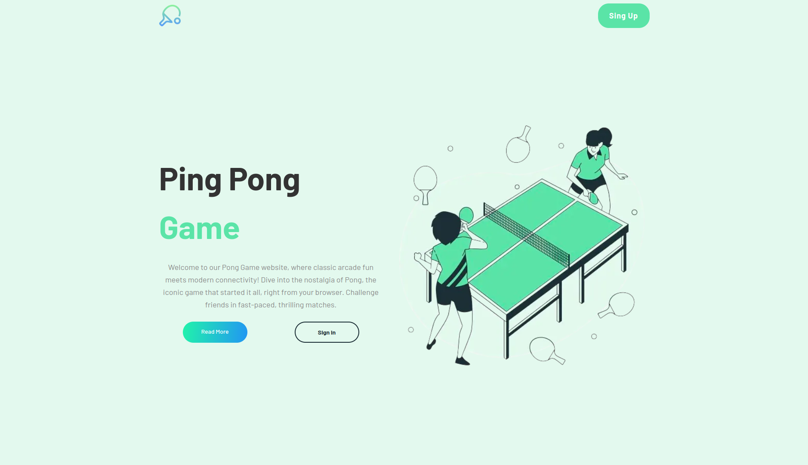
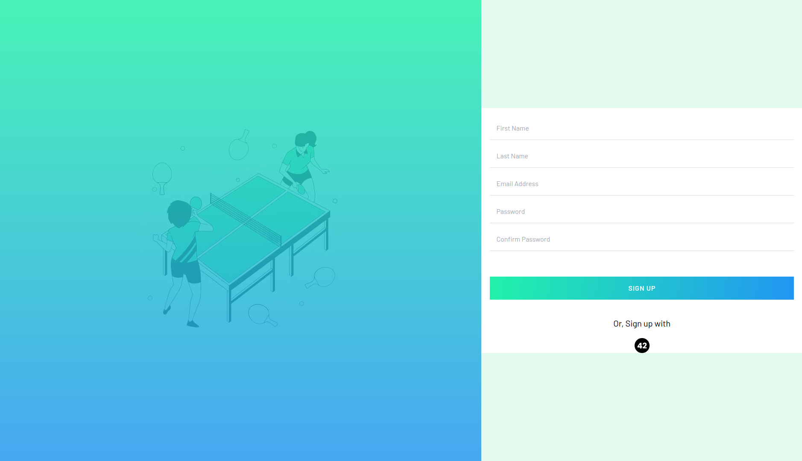
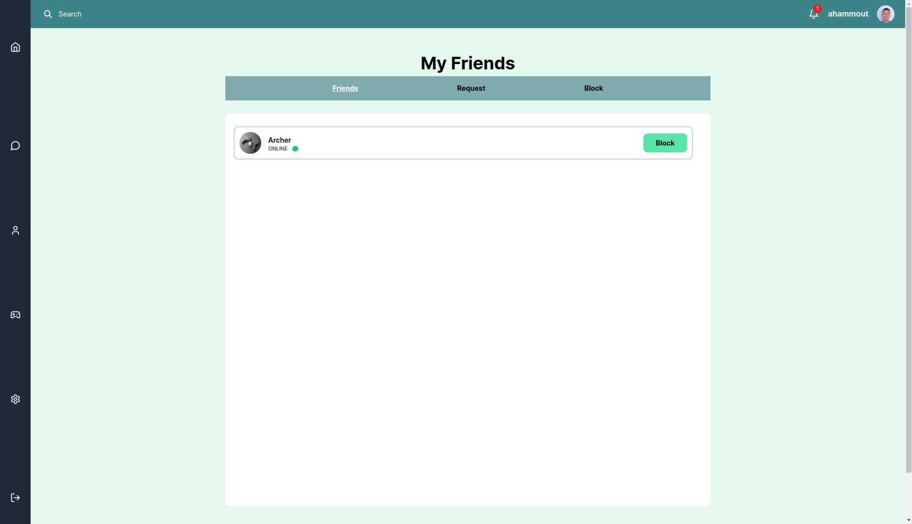
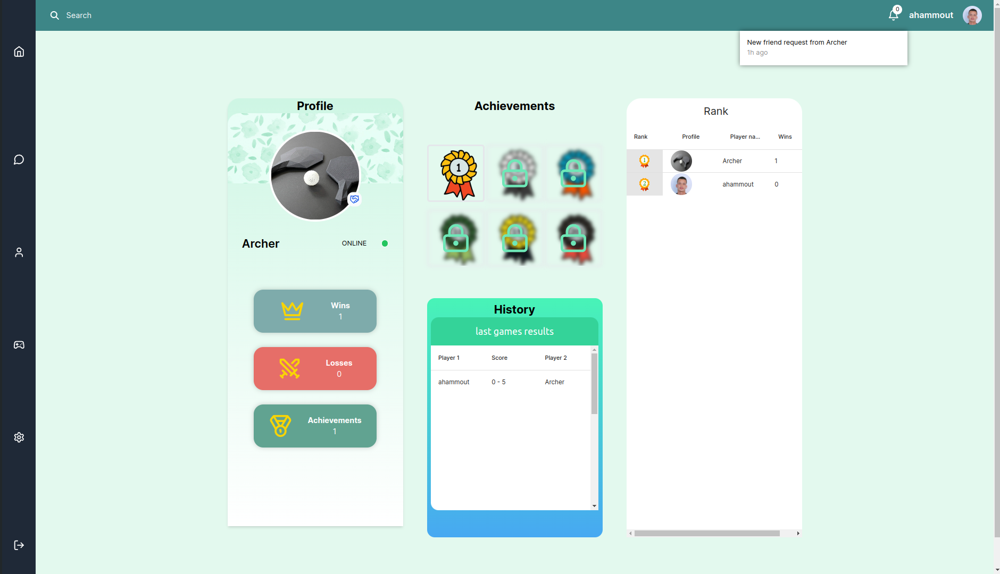


> Game

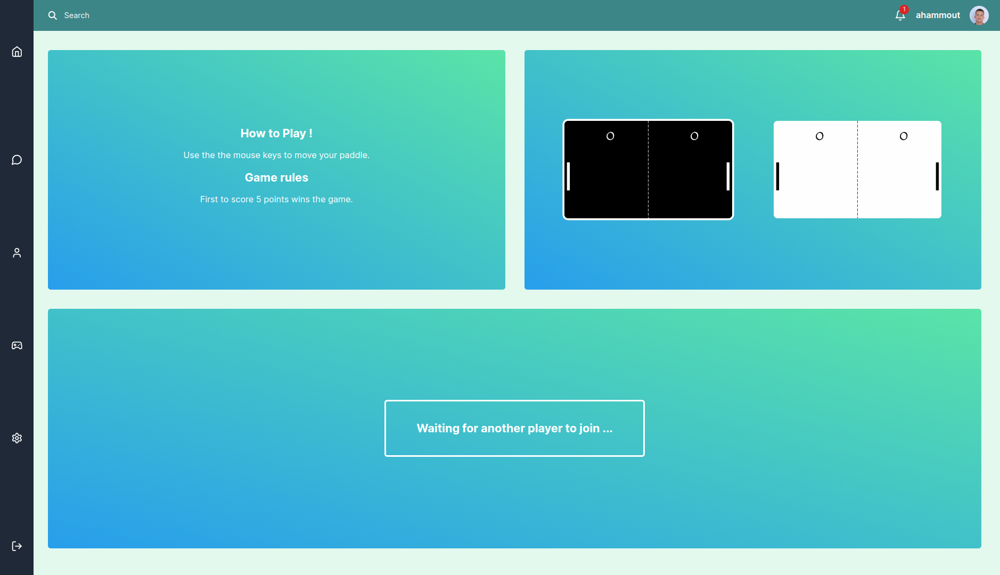
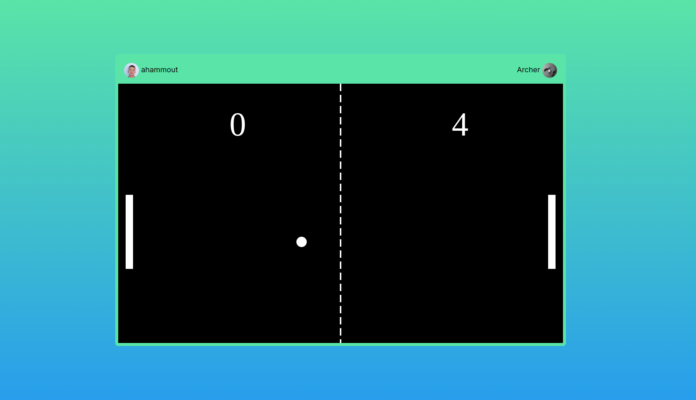


> Chat

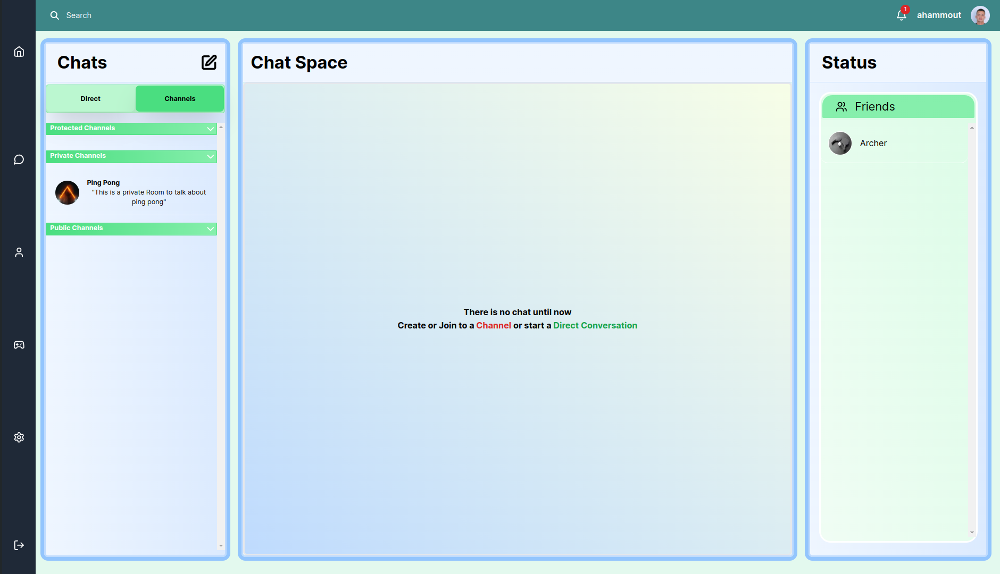
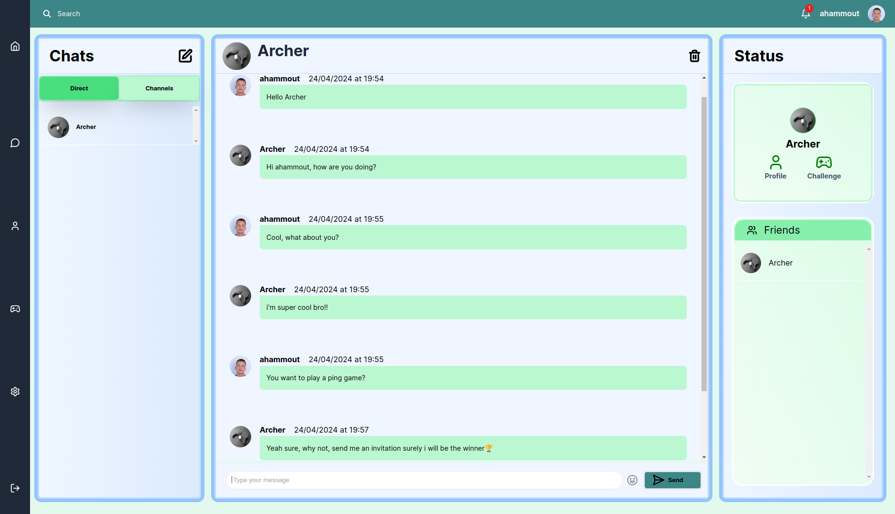
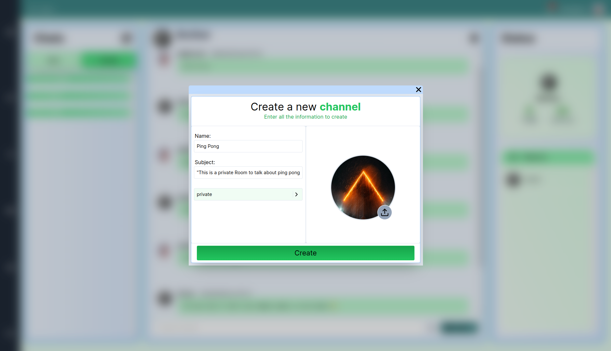
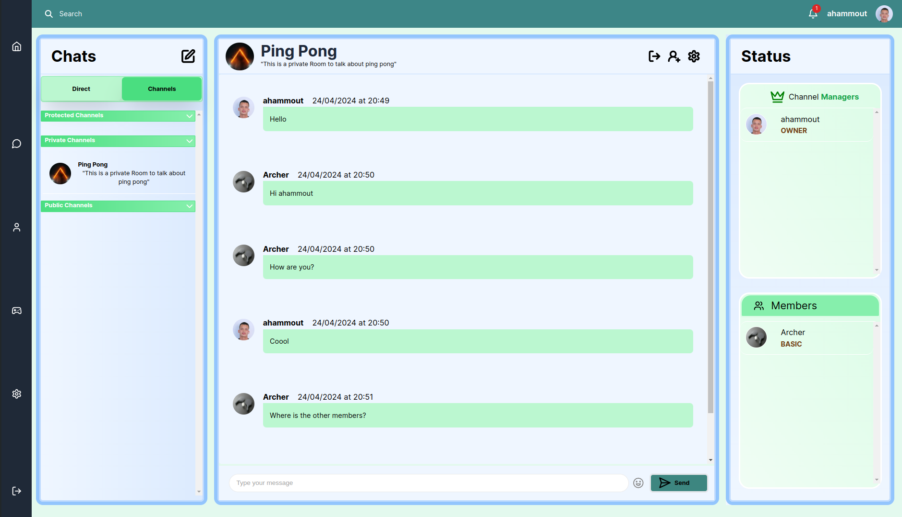
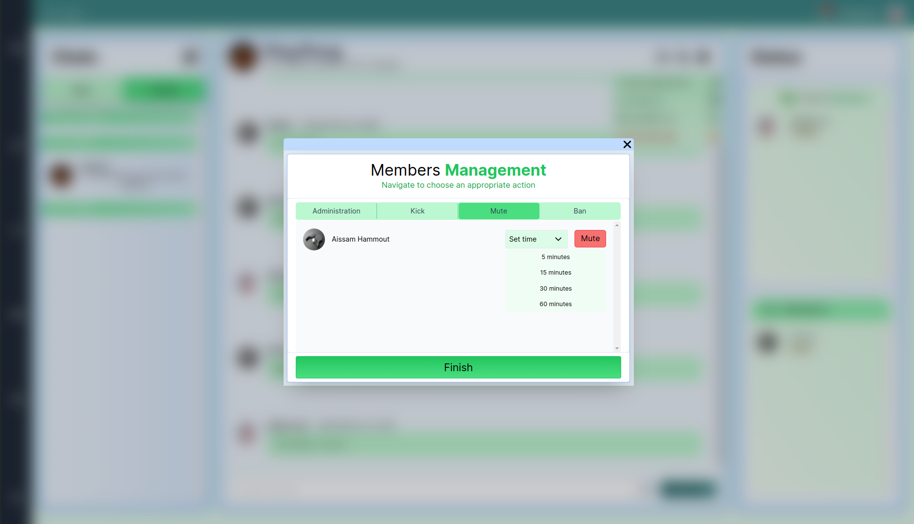
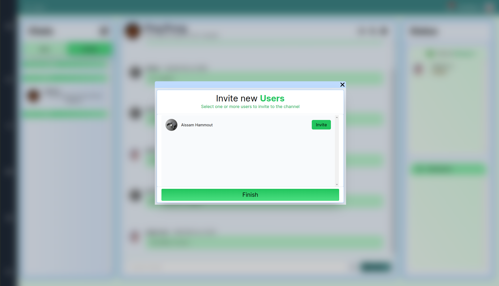

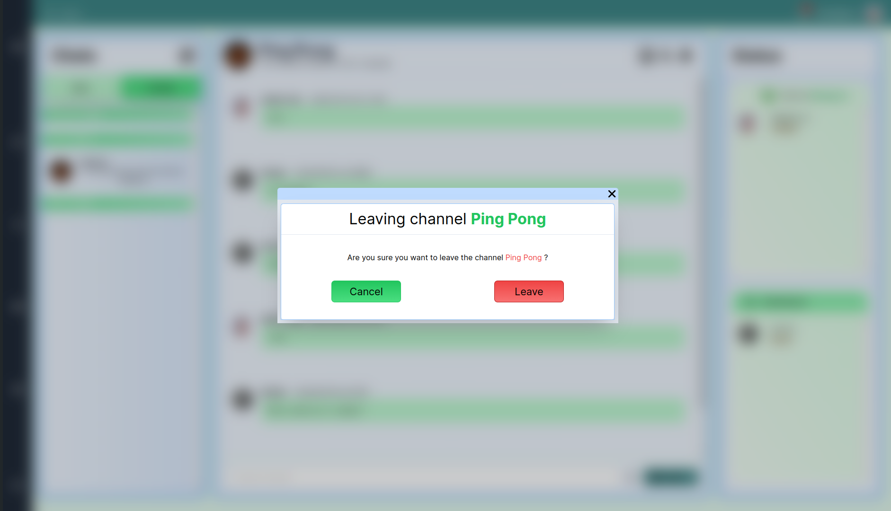

